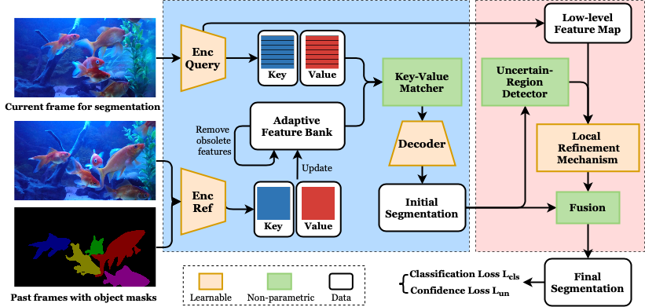

# Video Object Segmentation with Adaptive Feature Bank and Uncertain-Region Refinement

This repository is the official implementation of Video Object Segmentation with Adaptive Feature Bank and Uncertain-Region Refinement (NeurIPS 2020).
It is designed for semi-supervised video object segmentation (VOS) task. 


## 1. Requirements

We build and test the repository on Python 3.6.9 and Ubuntu 18.04. 
Run on Windows or Mac is possible with minor modifications. 
An NVIDIA GPU card and CUDA environment are required.
To install requirements:
```bash
pip3 install -r requirements.txt
```

## 2. Evaluation

### DAVIS17-TrainVal
1. Download and extract [DAVIS17-TrainVal](https://data.vision.ee.ethz.ch/csergi/share/davis/DAVIS-2017-trainval-480p.zip) dataset.
2. Download the pretrained DAVIS17 checkpoint.
3. run:
```bash
python3 eval.py --level 1 --resume /path/to/checkpoint.pth/ --dataset /path/to/dir/
```
To reproduce the segmentation scores, you can use the official evaluation [tool](https://davischallenge.org/davis2017/code.html) from DAVIS benchmark.

### YouTube-VOS18
1. Download and extract [YouTube-VOS18](https://competitions.codalab.org/competitions/19544#participate-get_data) dataset.
2. Download the pretrained YouTube-VOS18 checkpoint.
3. run:
```bash
python3 eval.py --level 2 --resume /path/to/checkpoint.pth/ --dataset /path/to/dir/ --update-rate 0.05
```
Attention: Directly submit our results to the YouTube-VOS codalab for evaluation will pollute the leader board.

### Long-time Video
1. Download and extract [Long-time Video](https://competitions.codalab.org/competitions/19544#participate-get_data) dataset.
2. Download the pretrained long-time video checkpoint.
3. run:
```bash
python3 eval.py --level 3 --resume /path/to/checkpoint.pth/ --dataset /path/to/dir/ --update-rate 0.05
```
To reproduce the segmentation scores, you can use the same tool from the DAVIS benchmark.

### Options for Evaluation
1. `--gpu`: GPU id to run (default: 0).
2. `--viz`: Enable output overlays along with the estimated masks (default: False).
3. `--budget`: The number of features that can be stored in total (default: 300000 for 1080Ti).

By default, the segmentation results will be saved in `./output`.

## 3. Training

### Pre-training on Static Images

1. Download the following the datasets.
2. Download the mask [palette image](assets/mask_palette.png) (followed DAVIS), which provides the color map of objects. 
3. Run `unify_pretrain_dataset.py` to convert them into a uniform format (followed DAVIS).
```bash
python3 unify_pretrain_dataset.py --name NAME --src /path/to/dataset/dir/
```
1. [MSRA10K](https://mmcheng.net/msra10k/):  `--name MSRA10K`
2. [ECSSD](http://www.cse.cuhk.edu.hk/leojia/projects/hsaliency/dataset.html): `--name ECSSD`
3. [PASCAL-S](http://cbs.ic.gatech.edu/salobj/download/salObj.zip): `--name PASCAl-s`
4. [PASCAL VOC2012](http://host.robots.ox.ac.uk/pascal/VOC/voc2012/): `--name PASCALVOC2012`
5. [COCO](http://cocodataset.org/#download): `--name COCO`.
    API [pycocotools](https://github.com/cocodataset/cocoapi/tree/master/PythonAPI) is required. 

You may need minor modifications in the dataset path. Descriptions of useful options,

1. `--dst`: Path to the output dataset.
2. `--palette`: Path to the palette image.
3. `--workder`: The parallel threads number to accelerate the procedures (Default: 20).

After the conversion process, you can start pre-training the model:
```bash
python3 train.py --level 0 --dataset /path/to/pretrain/ --lr 1e-5 --scheduler-step 3 --total-epoch 12 --log
```  
Pre-training process may takes days to weeks, you can download our checkpoint to save time.

### Training on DAVIS17

Download the semi-supervised TrainVal 480p from the [DAVIS](https://davischallenge.org/davis2017/code.html) website.
Run 
```bash
python3 train.py --level 1 --new --resume /path/to/PreTrain/checkpoint.pth --dataset /path/to/DAVIS17/ --lr 4e-6 --scheduler-step 200 --total-epoch 1000 --log
``` 

### Training on YouTube-VOS
Download the [YouTube-VOS](https://competitions.codalab.org/competitions/19544#participate-get_data) dataset.
Run
```bash
python3 train.py --level 2 --new --resume /path/to/PreTrain/checkpoint.pth --dataset /path/to/YouTubeVOS/train --lr 4e-6 --scheduler-step 30 --total-epoch 150 --log
```

## 4. License

This repository is released for academic use only. If you want to use our codes for commercial products, please contact xinli@cct.lsu.edu in advance.
If you use our codes, please cite our paper,
```bibtex
@inproceedings{liang2020video,
  title={Video Object Segmentation with Adaptive Feature Bank and Uncertain-Region Refinement},
  author={Liang, Yongqing and Li, Xin and Jafari, Navid and Chen, Qin},
  booktitle={Advances in neural information processing systems},
  year={2020}
}
```
